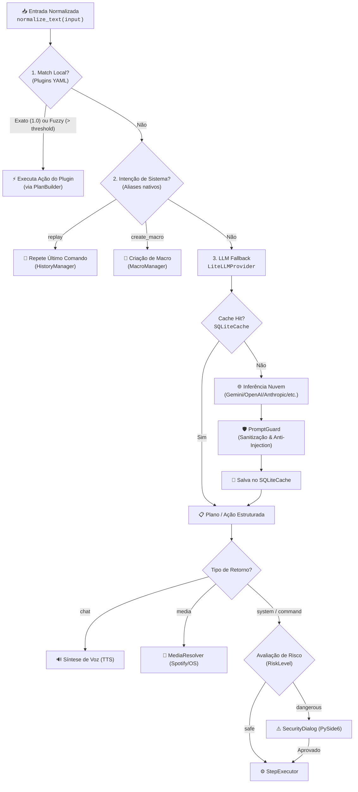

# 🧭 Roteamento Inteligente de Comandos e Resolução de Intenções

Este documento detalha o subsistema de **Resolução e Roteamento de Comandos** do Jarvis AI (`core/ai/command_resolver.py` e `core/execution/worker.py`), responsável por interpretar instruções vindas de voz (STT) ou de teclado (Command Palette) e direcioná-las com a menor latência e maior segurança possíveis.

---

## 🎯 Filosofia de Roteamento: Local-First

O Jarvis adota uma abordagem estritamente escalonada (*cascade routing*):
1. **Prioridade Máxima para Execução Local:** Qualquer ação previsível deve ser resolvida offline em microssegundos, sem chamadas de rede ou consumo de tokens.
2. **Normalização Simétrica:** Garantir que discrepâncias de pontuação, acentuação ou espaços nunca causem falsos negativos na comparação de strings.
3. **Recurso à Nuvem sob Demanda:** A Inteligência Artificial generativa (LLMs) é invocada somente para linguagem natural livre, consultas complexas ou ações não catalogadas localmente.

---

## 🔍 Detalhamento das Camadas

### 1. Normalização Simétrica de Entrada
Antes de qualquer comparação sintática ou semântica, tanto o texto capturado pelo usuário quanto os comandos cadastrados nos plugins passam obrigatoriamente pela função utilitária `normalize_text` ([`core/shared/utils.py`](../../core/shared/utils.py)):
- Conversão para minúsculas.
- Remoção de acentos ortográficos e caracteres especiais.
- Limpeza de espaços redundantes e normalização de pontuação.

> [!IMPORTANT]
> **Regra de Ouro (Normalização Simétrica):** Nunca compare uma string normalizada com uma string crua. Ambas as pontas da comparação devem ser normalizadas para evitar inconsistências entre o STT e o dicionário de comandos.

---

### 2. Estágio 1: Resolução Local via Plugins (`CommandResolver`)
O [`CommandResolver`](../../core/ai/command_resolver.py) carrega dinamicamente todas as intenções e frases de ativação registradas na pasta `plugins/`:

1. **Match Exato ($O(1)$):**
   - Um mapa indexado por dicionário verifica se a frase exata corresponde a um comando configurado.
   - Retorna um `ResolutionResult` com `confidence = 1.0` e `source = "voice_exact"`.
   - *Latência típica:* < 1ms.

2. **Match Difuso / Fuzzy (Levenshtein via `difflib.SequenceMatcher`):**
   - Caso o match exato não ocorra, o resolver calcula a similaridade estrutural contra todas as frases de comando conhecidas.
   - O limiar de aceitação (`fuzzy_match_threshold`) é configurável no `config.yaml` (padrão: `0.70`).
   - Se o maior score superar o limiar, o comando é aceito com `source = "voice_fuzzy"` e score correspondente.
   - *Exemplo:* Usuário diz *"Abrir o projeto front"* -> Casa com a frase configurada *"Abrir projeto frontend"*.

---

### 3. Estágio 2: Comandos Especiais do Sistema
O resolver possui um conjunto de frases reservadas (`SYSTEM_ALIASES`) para acionar recursos de metagestão do próprio Jarvis:

- **`replay`** (*"faz de novo"*, *"repetir"*, *"repete"*, *"de novo"*):
  - Consulta o banco [`core/persistence/history_db.py`](../../core/persistence/history_db.py) buscando a última ação executada com sucesso e a redispara.
- **`create_macro`** (*"salvar como macro"*, *"criar macro"*, *"gravar sequencia"*):
  - Inicia o fluxo do [`core/plugins/macro_manager.py`](../../core/plugins/macro_manager.py), agregando as últimas ações do histórico e gerando uma macro declarativa em YAML.

---

### 4. Estágio 3: Roteamento Semântico e IA na Nuvem
Se o comando não foi resolvido localmente, ele é submetido ao pipeline de IA em [`core/execution/worker.py`](../../core/execution/worker.py):

1. **Cache Local (`SQLiteCache`):**
   - Calcula o hash SHA-256 da instrução e contexto. Se já tiver sido respondido anteriormente e estiver dentro do TTL, retorna o plano imediatamente sem chamada de rede.
2. **Inferência Multi-Provedor (`LiteLLMProvider`):**
   - Encaminha o prompt para o provedor ativo configurado no Keyring/YAML (Gemini, OpenAI, Anthropic, DeepSeek, OpenRouter).
   - O prompt impõe saída estrita em JSON com tipagem clara (`chat`, `media`, `system`).
3. **Tratamento de Mídia (`MediaResolver`):**
   - Intenções de tocar música, pausar ou alterar faixas são encaminhadas para o módulo de mídia ([`core/media/`](../../core/media/)), integrando visão computacional via OpenCV para o Spotify e comandos de teclado do Windows.
4. **Proteção de Prompt e Risco (`PromptGuard`):**
   - Sanitização de instruções contra ataques de injeção de prompt (*jailbreaking* ou comandos de terminal destrutivos).
   - Classificação do nível de risco (`RiskLevel: safe | dangerous | blocked`).
   - Comandos com risco elevado exigem confirmação explícita pelo usuário via diálogo modal [`SecurityDialog`](../../core/ui/security_ui.py) (por voz ou clique).

---

## 📊 Resumo Comparativo de Desempenho

| Etapa | Mecanismo | Latência Média | Conexão Internet? | Custo / Quota |
| :--- | :--- | :--- | :--- | :--- |
| **Match Exato** | Hash Map Lookup | < 1 ms | ❌ Não | Zero |
| **Match Fuzzy** | SequenceMatcher | 2 - 5 ms | ❌ Não | Zero |
| **Comandos do Sistema** | SQLite Query (History) | 5 - 15 ms | ❌ Não | Zero |
| **LLM Cache Hit** | SQLite SHA-256 Lookup | 5 - 10 ms | ❌ Não | Zero |
| **LLM Cloud Call** | LiteLLM API | 800 - 2500 ms | 🌐 Sim | Consome tokens de API |
