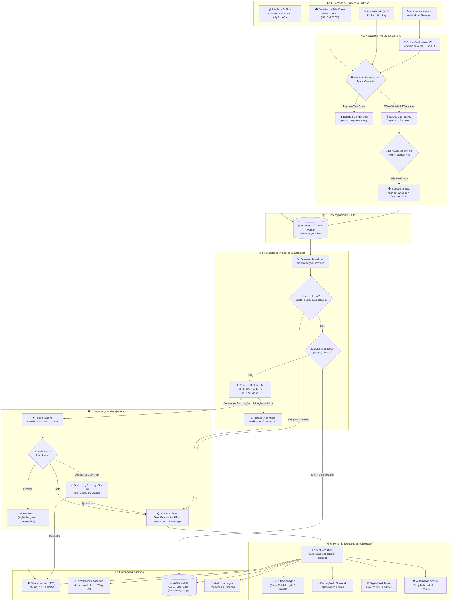
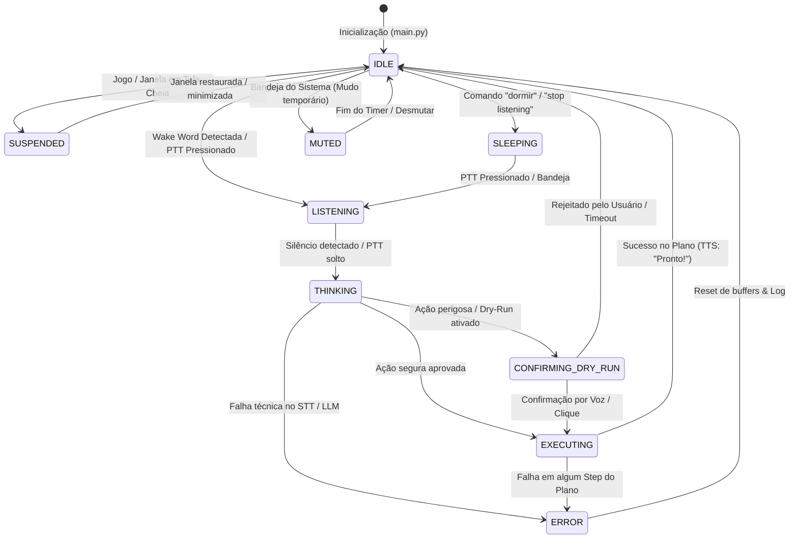
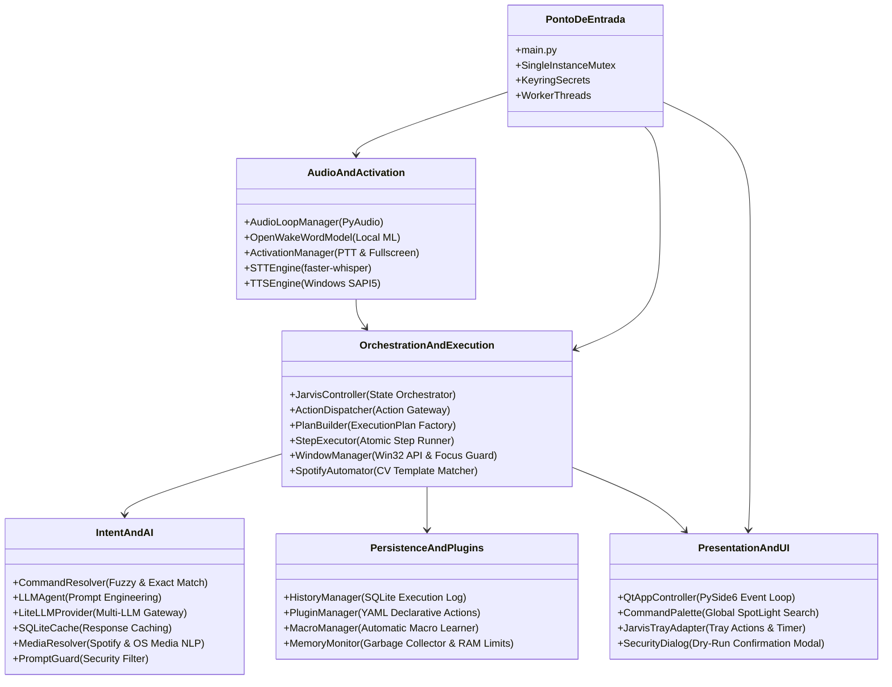

# 🧠 Visão Consolidada e Grafo de Funcionamento do Jarvis AI

Este documento apresenta a arquitetura completa, o fluxo de dados ponta a ponta e a máquina de estados do **Jarvis AI Assistant** (`python-jarvis`).

---

## 🗺️ 1. Grafo de Fluxo Consolidado Ponta a Ponta

O diagrama abaixo ilustra o ciclo de vida completo de uma instrução: desde a captura de áudio ou texto até a execução física no sistema operacional e feedback ao usuário.

---

## 🔄 2. Máquina de Estados Global (`JarvisState`)

O Jarvis opera sob uma máquina de estados finitos centralizada gerenciada pelo [`state_manager`](../../core/runtime/state.py). Modelos pesados (como STT) são descarregados dinamicamente para poupar memória RAM quando o assistente está inativo ou suspenso.

---

## 🏛️ 3. Visão Consolidada das Camadas da Aplicação

---

## 📂 4. Principais Módulos do Sistema

| Camada / Componente | Arquivo Principal | Responsabilidade |
| :--- | :--- | :--- |
| **Ponto de Entrada** | [`main.py`](../../main.py) | Bootstrap, migração segura de credenciais para Keyring, inicialização de threads e interface PySide6. |
| **Orquestrador de Áudio** | [`core/controller.py`](../../core/controller.py) | Loop de áudio em tempo real, detecção de wake words e gestão de estados de escuta. |
| **Gerenciador de Ativação** | [`core/activation.py`](../../core/activation.py) | Avaliação híbrida de ativação (PTT, wake word, supressão em jogos fullscreen via Win32 `WS_CAPTION`). |
| **Speech-to-Text** | [`core/audio/stt_engine.py`](../../core/audio/stt_engine.py) | Transcrição de áudio ultrarrápida usando `faster-whisper` com carregamento sob demanda (*lazy-load*). |
| **Resolução de Comandos** | [`core/ai/command_resolver.py`](../../core/ai/command_resolver.py) | Match exato e fuzzy local com normalização simétrica antes de recorrer a LLMs. |
| **Agente Inteligente** | [`core/ai/llm_agent.py`](../../core/ai/llm_agent.py) | Conexão com LLMs via `LiteLLMProvider` com cache SQLite e fallback de conectividade. |
| **Guarda de Segurança** | [`core/ai/prompt_guard.py`](../../core/ai/prompt_guard.py) | Validação contra injeção de prompt e sanitização de planos de execução. |
| **Fila e Worker** | [`core/execution/worker.py`](../../core/execution/worker.py) | Consumo assíncrono de jobs com separação estrita de `BusinessError` vs `TechnicalError` e retry com backoff exponencial. |
| **Despachante & Segurança** | [`core/execution/dispatcher.py`](../../core/execution/dispatcher.py) | Roteamento de planos, verificação de níveis de risco (`RiskLevel`) e confirmação de Dry-Run. |
| **Executor de Passos** | [`core/execution/step_executor.py`](../../core/execution/step_executor.py) | Execução de ações atômicas (`WRITE`, `COMMAND`, `HOTKEY`, `OPEN_APP`, `SPOTIFY_CLICK_PLAY`) com trava de foco da janela ativa. |
| **Janelas do Windows** | [`core/execution/window_manager.py`](../../core/execution/window_manager.py) | Gerenciamento de janelas via Win32 API, posicionamento e validação de perda de foco. |
| **Visão Computacional & Mídia** | [`core/media/cv_matcher.py`](../../core/media/cv_matcher.py) | Localização visual de elementos na UI do Spotify via OpenCV template matching. |
| **Auditoria & Histórico** | [`core/persistence/history_db.py`](../../core/persistence/history_db.py) | Registro de todas as ações no SQLite para auditoria, repetição de comandos e criação automática de macros. |
| **Estado Global** | [`core/runtime/state.py`](../../core/runtime/state.py) | Máquina de estados com callbacks para transições seguras e gerenciamento de recursos. |
