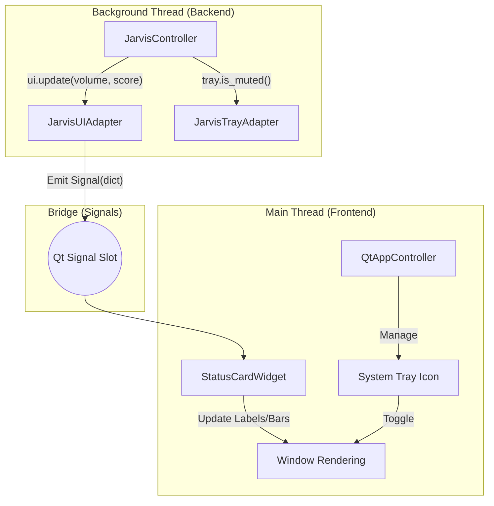

# UI Architecture: PySide6 & Fluent Design

This document describes the modular UI architecture of Jarvis, focusing on the migration from terminal-based output to a modern graphical interface using **PySide6** and **PyQt-Fluent-Widgets**.

## Why this architecture?

1.  **Backend Integrity**: The core AI and audio logic (`JarvisController`) remains strictly decoupled from the UI. It doesn't know it's running inside a Qt application.
2.  **Thread Safety**: Real-time audio processing cannot be blocked by UI rendering. By isolating them in different threads and using **Qt Signals**, we ensure smooth performance for both.
3.  **Stability & Modernity**: Combining `qdarktheme` (for a robust, consistent dark base) with `PyQt-Fluent-Widgets` (for modern Win11-style components) provides a high-end feel with minimal custom CSS maintenance.
4.  **Resilience**: Using explicit adapters and lifecycle controllers prevents "ghost processes" and ensures the app can survive backend crashes.

## Component Stack

We use a layered styling approach:
-   **qdarktheme**: Provides the global CSS foundation (colors, base widget styles).
-   **PyQt-Fluent-Widgets**: Provides the high-level functional components (Cards, ProgressBars, Titles) with Fluent Design.
-   **Custom QSS**: Very specific overrides (via ObjectNames) for fine-tuning Jarvis-specific visuals without breaking the layers above.

## Core Layers

### 1. The Adapters (`core/ui/adapter.py`)
-   **JarvisUIAdapter**: Acts as a bridge. It implements the interface expected by the `JarvisController` (methods like `update()` and `get_live()`) but translates these calls into **Qt Signals** (`visual_state_updated`).
-   **JarvisTrayAdapter**: Handles mute logic and state transitions originally managed by the tray icon.

### 2. The App Controller (`core/ui/app_controller.py`)
-   Centralizes the GUI lifecycle (`QApplication` management).
-   Manages the **System Tray Icon** (`QSystemTrayIcon`) and its dynamic menu.
-   Orchestrates window visibility and theme application.

### 3. The UI View (`core/ui/main_window.py` & `core/ui/widgets/`)
-   **MainWindow**: Hosts modular widgets and intercepts `closeEvent` to hide to tray.
-   **StatusCardWidget**: A modular component using `qfluentwidgets` that reacts to Signal snapshots.

---

## Visual Flow

---

## Threading & Communication

### Main Thread (GUI Thread)
-   Runs `app.exec()`.
-   **Communication**: Receives data from the backend via thread-safe **Qt Signals** emitted by the `JarvisUIAdapter`.

### Background Thread (Backend Controller)
-   Runs the blocking `JarvisController.start()` loop.
-   **Communication**: Calls `ui.update()` on the adapter. Since the adapter inherits from `QObject`, its signals are automatically marshaled to the main thread safely.

## Error Handling
-   **Qt Exception Hook**: A global `sys.excepthook` captures uncaught GUI exceptions.
-   **Safe Controller Wrapper**: The background thread is wrapped in a `try/except` to trigger a clean shutdown if the AI core fails.
