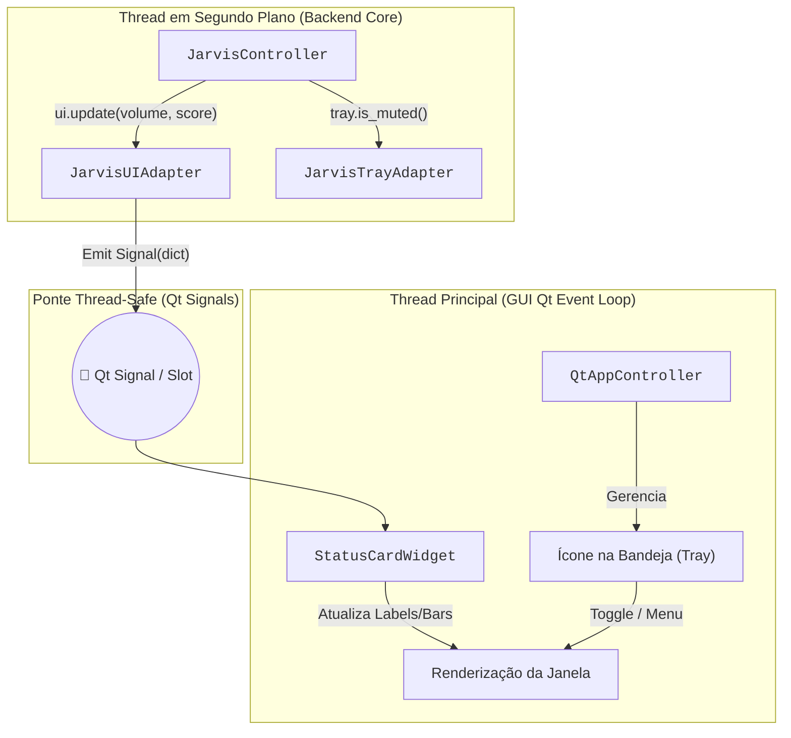

# 💻 Arquitetura de Interface Gráfica: PySide6 & Fluent Design

Este documento descreve a arquitetura modular da interface gráfica (UI) do Jarvis, detalhando a transição das saídas legadas de terminal para uma interface visual moderna utilizando **PySide6** e **PyQt-Fluent-Widgets**.

---

## 🎯 Por que esta Arquitetura?

1. **Integridade do Backend**: O núcleo de IA e áudio (`JarvisController`) permanece estritamente desacoplado da interface gráfica. Ele não possui conhecimento direto de que está rodando dentro de uma aplicação Qt.
2. **Thread Safety**: O processamento de áudio em tempo real não pode ser bloqueado pela renderização da interface. Ao isolá-los em threads distintas e utilizar **Qt Signals**, garantimos alto desempenho e fluidez para ambos.
3. **Estabilidade e Modernidade**: A combinação do `qdarktheme` (para uma base escura robusta e consistente) com o `PyQt-Fluent-Widgets` (para componentes modernos no estilo Windows 11) oferece um acabamento refinado com manutenção mínima de CSS customizado.
4. **Resiliência e Ciclo de Vida**: O uso de adaptadores explícitos e controladores de ciclo de vida evita processos órfãos (*ghost processes*) e assegura que a aplicação finalize seus recursos de forma limpa.

---

## 🛠️ Camadas de Componentes Visuais

Utilizamos uma abordagem de estilização em camadas:
- **`qdarktheme`**: Fornece a base global de folhas de estilo (cores fundamentais, tipografia e estilos base de widgets).
- **`PyQt-Fluent-Widgets`**: Fornece componentes funcionais de alto nível (Cards, ProgressBars, Navigation, Titles) seguindo o Fluent Design.
- **QSS Customizado**: Sobrescritas pontuais e cirúrgicas (via `setObjectName`) para ajustes visuais específicos do Jarvis, preservando a estabilidade das camadas subjacentes.

---

## 🏛️ Camadas Centrais da UI

### 1. Os Adaptadores (`core/ui/adapter.py`)
- **`JarvisUIAdapter`**: Atua como uma ponte (*bridge*). Ele implementa a interface esperada pelo `JarvisController` (métodos como `update()` e `get_live()`), mas traduz essas invocações em **Qt Signals** seguros (`visual_state_updated`).
- **`JarvisTrayAdapter`**: Gerencia a lógica de silenciamento temporário (*mute*) e transições de estado originadas pelo menu da bandeja do sistema.

### 2. O Controlador da Aplicação (`core/ui/app_controller.py`)
- Centraliza o ciclo de vida da interface gráfica (`QApplication`).
- Gerencia o ícone na **Bandeja do Sistema** (`QSystemTrayIcon`) e seus menus contextuais 100% em português brasileiro.
- Suporta o modo **Onboarding Gráfico (`onboarding_mode`)**, abrindo automaticamente as configurações com um aviso claro caso nenhuma chave de API esteja configurada.
- Garante o encerramento gracioso e limpo do processo, ocultando o ícone da bandeja (`tray_icon.hide()`) prioritariamente para evitar ícones fantasmas na barra de tarefas do Windows.

### 3. As Views da Interface (`core/ui/main_window.py`, `tabs/` & `widgets/`)
- **`MainWindow` ("Painel do Jarvis")**: Janela principal com navegação moderna Fluent (`Pivot`). Hospeda três abas modulares:
  - **Aba Status (`StatusCardWidget`)**: Exibe o status do motor, modos de ativação ("Híbrido", "Aperte para Falar", "Silenciado", "Dormindo"), níveis de decibéis e pontuação de escuta.
  - **Aba Histórico (`HistoryTab`)**: Tabela de auditoria do SQLite com busca e atualização dinâmica dos comandos executados.
  - **Aba Configurações (`SettingsTab`)**: Configuração de perfil de performance, seleção de provedor LLM, cadastro direto de chave de API no Windows Keyring com re-inicialização em memória e controle de Autostart.
- **`CommandPalette`**: Interface rápida estilo Spotlight (`Ctrl+Shift+P`) para comandos manuais por teclado.
- **`VoiceOverlay`**: HUD flutuante semi-transparente que exibe feedback visual do microfone durante a fala.
- **`SecurityDialog`**: Modal de autorização de segurança para comandos classificados com nível de risco elevado (`dangerous`).

---

## 🔄 Fluxo de Comunicação e Sinais

```mermaid
graph TD
    subgraph "Thread em Segundo Plano (Backend Core)"
        JC["<code>JarvisController</code>"] -- "ui.update(volume, score)" --> AD["<code>JarvisUIAdapter</code>"]
        JC -- "tray.is_muted()" --> TA["<code>JarvisTrayAdapter</code>"]
    end

    subgraph "Ponte Thread-Safe (Qt Signals)"
        AD -- "Emit Signal(dict)" --> SIG(("📡 Qt Signal / Slot"))
    end

    subgraph "Thread Principal (GUI Qt Event Loop)"
        SIG --> SC["<code>StatusCardWidget</code>"]
        SC -- "Atualiza Labels/Bars" --> GUI["Renderização da Janela"]
        APP["<code>QtAppController</code>"] -- "Gerencia" --> TRAY["Ícone na Bandeja (Tray)"]
        TRAY -- "Toggle / Menu" --> GUI
    end
```

---

## 🧵 Threading & Comunicação Entre Processos

### Thread Principal (GUI / Event Loop)
- Executa o loop de eventos `app.exec()`.
- **Comunicação**: Recebe dados do backend exclusivamente através de **Qt Signals** disparados pelo `JarvisUIAdapter`, garantindo conformidade estrita com o modelo de threads do Qt.

### Thread em Segundo Plano (Worker de Execução & Controller)
- Executa o loop contínuo de áudio e ativações (`JarvisController.start()`) e consumo de tarefas (`command_worker`).
- **Comunicação**: Chama `ui.update()` no adaptador. Como o adaptador herda de `QObject`, os sinais emitidos são automaticamente despachados (*marshaled*) para a thread de UI de maneira segura e assíncrona.

---

## 🛡️ Tratamento de Exceções na UI
- **Qt Exception Hook**: Um hook global em `sys.excepthook` captura exceções não tratadas na interface gráfica, registrando o traceback detalhado no log e disparando uma notificação desktop amigável ao usuário via `JarvisNotifier`, garantindo que falhas em binários sem console (`--noconsole`) nunca passem despercebidas.
- **Wrapper Seguro do Controller**: A thread de backend é encapsulada em blocos `try/except` que notificam a UI caso o núcleo de áudio ou IA encontre uma falha irrecuperável, permitindo a finalização segura dos dispositivos de hardware.
