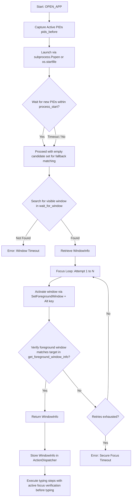

# Technical Specification: Timing Hardening & Robust Window/Process Handling

- **Author:** Antigravity (AI Coding Assistant)
- **Date:** 2026-06-05
- **Status:** Approved by User (Awaiting Implementation Plan)
- **Scope:** Hardening application launching (`StepType.OPEN_APP`), dynamic timing controls, and active foreground focus verification to prevent typing into incorrect windows.

---

## 1. Context & Objectives

Currently, when executing workflows based on an `ExecutionPlan`, Jarvis launches applications and relies on static waiting times (`time.sleep`) configured in YAML files or generated heuristically. If the system is under heavy load, applications may take longer to initialize and focus, causing keystrokes and hotkeys to be dispatched to whatever window was previously active (e.g., the user's IDE or chat applications).

This specification addresses this vulnerability by implementing:
1. **Dynamic Process Waiting**: Abandoning static delays and polling for new PIDs to appear on the OS.
2. **Visible Window Detection**: Tracking when the target application's visible window is created.
3. **Active Window Focus & Activation**: Forcing focus using SAPI5/Windows API controls (Alt key + `SetForegroundWindow` trick) with retries.
4. **Foreground Focus Verification**: Verifying that the current active foreground window matches the target application prior to typing any characters.
5. **Configurable Timeouts**: Exposing all timing limits in `config.yaml`.

---

## 2. Architecture & Control Flow

The execution workflow during a `StepType.OPEN_APP` step will proceed as follows:



---

## 3. Component Specification

### 3.1. Configurations (`config.yaml`)
New timing parameters will be added to control timeout values:

```yaml
timeouts:
  process_start: 5.0     # Maximum time (s) to wait for new process PIDs to appear
  window_appear: 10.0    # Maximum time (s) to wait for a visible window to be created
  focus: 3.0             # Maximum time (s) to wait for a window to gain focus during a try
  focus_retries: 3       # Number of activation/focus retries before aborting
```

### 3.2. Data Structures (`WindowInfo`)
Defined in `core/execution/automator.py`:

```python
from dataclasses import dataclass

@dataclass
class WindowInfo:
    hwnd: int
    pid: int
    executable: str
    title: str
```

### 3.3. Auxiliary Methods in `WarpAutomator` (`core/execution/automator.py`)

*   **`find_processes(executable_path: str = None, executable_name: str = None) -> set[int]`**:
    Returns active PIDs matching the given path or filename using `psutil`.
*   **`get_foreground_window_info() -> WindowInfo | None`**:
    Queries the active foreground window using `win32gui.GetForegroundWindow()`, resolves its PID via `win32process.GetWindowThreadProcessId`, and gets the executable name via `psutil`.
*   **`wait_for_window(candidate_pids: set[int] = None, executable_name: str = None, window_title_pattern: str = None, timeout: float = 10.0) -> WindowInfo | None`**:
    Iterates over windows via `win32gui.EnumWindows`, filtering for visible windows (`win32gui.IsWindowVisible`) with non-empty titles. Performs validation by checking if the window's PID is in `candidate_pids`, its executable matches `executable_name`, or its title matches `window_title_pattern` (using regex).
*   **`open_and_stabilize_app(target: str, window_title_pattern: str | None = None, process_name: str | None = None) -> WindowInfo`**:
    Launches the target program/URL, executes dynamic process discovery, tracks the visible window, and activates it. Returns the consolidated `WindowInfo`.

### 3.4. Strict Focus Matching Rules
Focus validation is performed using the following rules:
1. `active_win.hwnd == window.hwnd` (Direct window match)
2. `active_win.pid == window.pid` (Same process)
3. `active_win.executable.lower() == window.executable.lower()` **AND** `window_title_pattern` matches `active_win.title` (to avoid false positives with multiple instances of the same executable like Chrome or VS Code).

---

## 4. Run-Time Safety & Focus Loss Prevention

During step execution in `core/execution/dispatcher.py`:

1. When running `StepType.OPEN_APP`, the `ActionDispatcher` stores the returned target window info in `self._current_plan_window`.
2. Before executing input steps like `StepType.WRITE`, `StepType.TYPE_AND_ENTER`, and `StepType.HOTKEY`, the dispatcher verifies that the active foreground window matches `self._current_plan_window`.
3. If the user manually changes focus (switches windows) while the plan is running, execution is immediately aborted with a focus-safety error, preventing typing into the wrong context.

---

## 5. Testing & Validation Strategy

1. **Unit Tests**:
   * Mock Windows API calls (`win32gui`, `win32process`) to verify the focus loop retry logic when focus fails initially.
   * Test process tracking via mock `psutil` iterations.
2. **Integration Tests**:
   * Launch a standard system application (e.g., `notepad.exe`) and verify that the stabilization pipeline successfully returns `WindowInfo`.
   * Open a URL and ensure correct window lookup via title pattern.
   * Simulate user focus switching during plan execution to verify that input operations are aborted safely.
