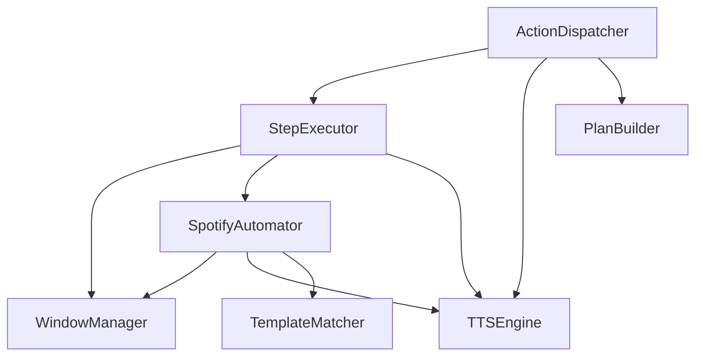

# Technical Specification: Modular Refactoring of Execution & Automation Layers

- **Author:** Antigravity (AI Coding Assistant)
- **Date:** 2026-07-05
- **Status:** Proposed (Awaiting User Review)
- **Scope:** Refactoring `core/execution/automator.py` and `core/execution/dispatcher.py` into distinct single-responsibility modules, resolving process iteration code duplication, fixing a TTS thread leak, and decoupling step routing into a dedicated `StepExecutor`.

---

## 1. Context & Objectives

Currently, `WarpAutomator` inside `core/execution/automator.py` acts as a monolithic class handling unrelated responsibilities: Windows Text-to-Speech (SAPI5), OS-level process and window tracking, Warp terminal-specific workflows, and Spotify UI automation (using CV template matching). Similarly, `ActionDispatcher` in `core/execution/dispatcher.py` handles both high-level intent routing/authorization and the fine-grained execution of individual steps.

Grep search analysis reveals that `WarpAutomator.run_workflow()`, `is_open()`, `find_window()`, and `activate_window()` are dead code. They are not called by any part of the active system (which now routes terminal commands via `ExecutionPlan` steps using generic application stabilization and key emulation).

This refactoring aims to:
1. **Apply Single Responsibility Principle (SRP)**: Split `WarpAutomator` and `ActionDispatcher` into modular, focused components.
2. **Remove Dead Code**: Completely delete `WarpAutomator.run_workflow()`, `is_open()`, `find_window()`, and `activate_window()`, deprecating and removing the `WarpAutomator` class entirely.
3. **Eliminate Duplication**: Re-use `find_processes` inside window and process-finding methods instead of repeating manual `psutil` loops.
4. **Decouple Computer Vision**: Move `locate_template_multiscale` out of Spotify automation into a reusable CV template matcher.
5. **Fix TTS Thread Leak**: Implement a clean `stop()` method for the SAPI5 thread worker instead of relying solely on daemon termination on exit.
6. **Decouple Step Execution**: Extract the large `_execute_step` routing mechanism from the dispatcher into a dedicated `StepExecutor` class.
7. **Decouple Plan Construction**: Extract config/wakeword translating logic (`_handle_warp`, `_handle_system`, `_handle_plugin`) into a dedicated `PlanBuilder` component.

---

## 2. Architecture & Dependencies

The refactored execution hierarchy strictly enforces a directed acyclic graph (DAG) of dependencies (with `WarpAutomator` removed):



---

## 3. Modular Specification

### 3.1. `TTSEngine` (`core/audio/tts_engine.py`)
- **Responsibility**: Manages SAPI5 voice speech, queue synchronization, and COM initialization.
- **Key Methods**:
  - `speak(text: str)`: Queues speech, deduplicates consecutive repetitions within 2.0s.
  - `is_speaking` property.
  - `stop()`: Triggers clean shutdown by setting `_stop_tts` event and joining the background worker thread.

```python
class TTSEngine:
    def __init__(self, config: dict[str, Any]) -> None:
        self.config = config
        self._speech_queue: queue.Queue[str] = queue.Queue()
        self._stop_tts = threading.Event()
        self.is_speaking = False
        self._tts_thread = threading.Thread(target=self._tts_worker, daemon=True)
        self._tts_thread.start()

    def _tts_worker(self) -> None:
        # COM setup, SAPI voice initialization, processing queue loop...
        pass

    def speak(self, text: str) -> None:
        pass

    def stop(self) -> None:
        self._stop_tts.set()
        self._tts_thread.join(timeout=2.0)
```

### 3.2. `WindowManager` (`core/execution/window_manager.py`)
- **Responsibility**: OS-level low-level actions. Focuses, queries, and interacts with generic Windows handles.
- **Key Methods**:
  - `find_processes(executable_path, executable_name)`: Returns set of process IDs matching inputs.
  - `get_foreground_window_info()`: Obtains information for currently focused window.
  - `check_focus_match(active_win, target_win, title_pattern)`: Focus safety verification rules.
  - `wait_for_window(...)`: Polls until a matching visible window is active.
  - `activate_window_by_hwnd(hwnd)`: Forcibly focuses window using win32 API / Alt-key tricks (includes retry loop).
  - `open_and_stabilize_app(...)`: Complete flow to start an application and guarantee active window focus.
  - `type_text(text)`: Hotkey paste emulation (`ctrl+v`).

### 3.3. `TemplateMatcher` (`core/media/cv_matcher.py`)
- **Responsibility**: OpenCV template matching (multi-scale gray-scaled matching).
- **Key Methods**:
  - `locate_template_multiscale(template_path, region, confidence)`: Generic multi-scale matcher (removes internal redundant `import os` statement).

### 3.4. `SpotifyAutomator` (`core/media/spotify_automator.py`)
- **Responsibility**: Domain-specific logic for Spotify control, including CV play buttons, window detection, and media playback starting sequences.
- **Key Methods**:
  - `find_spotify_window() -> Window`: Locates window by scanning processes (re-uses `WindowManager.find_processes`).
  - `activate_spotify_window() -> bool`: Restores and focuses Spotify.
  - `is_spotify_playing() -> bool`: Compares window titles to playing state lists.
  - `find_spotify_green_button(haystack, scale_factor)`: Color thresholding mask to detect green button bounds.
  - `spotify_click_play(click_type, uri)`: Autoplay sequence (DPI calculations, TemplateMatcher checks, fallback clicks, and tab-focus sequencing).

### 3.5. `StepExecutor` (`core/execution/step_executor.py`)
- **Responsibility**: Takes an individual `ExecutionStep` and executes it using the relevant helper.
- **Constructor Dependencies**: `config`, `window_manager`, `spotify_automator`, `tts_engine`.
- **Key Methods**:
  - `execute_step(step: ExecutionStep) -> bool`: Large switch routing execution types (e.g. `COMMAND`, `OPEN_APP`, `WRITE`, `HOTKEY`, `SPOTIFY_CLICK_PLAY`, etc.).

### 3.6. `PlanBuilder` (`core/execution/plan_builder.py`)
- **Responsibility**: Constructs executable `ExecutionPlan` structures from configuration parameters or static metadata, completely separating construction from execution.
- **Constructor Dependencies**: `config`.
- **Key Methods**:
  - `build_warp_plan(action_config: dict[str, Any]) -> ExecutionPlan`: Resolves environment-dependent paths (such as `integrations.warp.path`). If the resolved path is empty/not configured, it explicitly raises a `BusinessError` (with a friendly Portuguese message spoken by the dispatcher) to prevent launching empty targets.
  - `build_system_plan(action_config: dict[str, Any]) -> ExecutionPlan`
  - `build_plugin_plan(action_config: dict[str, Any]) -> ExecutionPlan`

### 3.7. `ActionDispatcher` (`core/execution/dispatcher.py`)
- **Responsibility**: High-level workflow orchestration, safety validation, macro creation, history recording, and authorization popups.
- **Constructor Dependencies**: `config`, `step_executor`, `tts_engine`, `plan_builder`, `audio_stream`.
- **Modifications**:
  - Deprecate `_execute_step()` entirely and delegate to `self.step_executor.execute_step()`.
  - Delegate `_handle_warp()`, `_handle_system()`, and `_handle_plugin()` to `self.plan_builder`.
  - Remove all deprecated `self.automator` references and shims. Expose `self.tts_engine` directly.

---

## 4. Integration, Test & Documentation Updates

1. **`main.py` Initialization**:
   - Instantiate:
     - `tts_engine = TTSEngine(config)`
     - `window_manager = WindowManager()`
     - `template_matcher = TemplateMatcher()`
     - `spotify_automator = SpotifyAutomator(config, window_manager, tts_engine, template_matcher)`
     - `step_executor = StepExecutor(config, window_manager, spotify_automator, tts_engine)`
     - `plan_builder = PlanBuilder(config)`
     - `dispatcher = ActionDispatcher(config, step_executor, tts_engine, plan_builder, stream)`
   - Graceful shutdown:
     - Catch cleanup events to call `tts_engine.stop()`.
2. **`JarvisController`**:
   - Update parameters to accept `tts_engine` instead of the complete `WarpAutomator` (since it only uses `speak` and `is_speaking`).
3. **Unit & Integration Tests**:
   - Refactor `tests/unit/test_automator_helpers.py` to target `WindowManager` directly.
   - Refactor `tests/integration/test_spotify.py` to instantiate and test `SpotifyAutomator` instead of the old `WarpAutomator`.
   - Update all references to `dispatcher.automator.speak` in files under `tests/` and `core/execution/worker.py` to target `dispatcher.tts_engine.speak` directly.
   - Remove obsolete assertions checking call counts of `run_workflow` (e.g. in `test_dispatcher_security.py`).
4. **Documentation Sync**:
   - Update repository documentation files (including `AGENTS.md` and any roadmap/architecture logs) to remove outdated descriptions of `WarpAutomator` and document the new modular execution pipeline.
