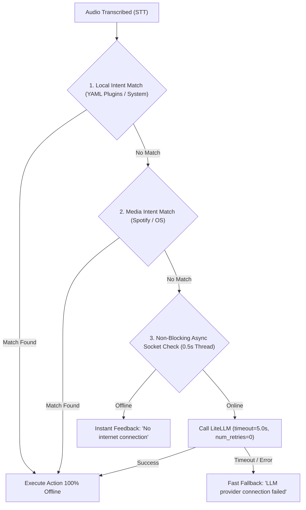

# 📐 Master Design Spec: User Experience, Resilience, Window Management & UI Polish

**Date:** 2026-08-05  
**Project:** Python Jarvis  
**Status:** Approved with Revisions  

---

## 🎯 Overview

This document specifies the technical architecture for enhancing user experience (UX), local/offline routing resilience, deterministic window management, and interface polish in Python Jarvis.

The implementation is structured into **3 Logical Phases** to ensure incremental, testable, and robust development.

---

## 📑 Table of Contents

- [Phase 1: Core, Routing & Offline Resilience](#-phase-1-core-routing--offline-resilience)
  - [1.1 Local-First Routing & Async Non-Blocking Connection Check](#11-local-first-routing--async-non-blocking-connection-check)
  - [1.2 LiteLLM Timeout & Zero-Retry Configuration](#12-litellm-timeout--zero-retry-configuration)
  - [1.3 Faster-Whisper Prompting & Regex Word-Boundary STT Post-Processing](#13-faster-whisper-prompting--regex-word-boundary-stt-post-processing)
  - [1.4 Scoped Full-Path Trusted Apps Whitelist](#14-scoped-full-path-trusted-apps-whitelist)
- [Phase 2: Window Automation & Multi-App Layouts](#-phase-2-window-automation--multi-app-layouts)
  - [2.1 Win32 Native Window Layout Manager (DPI-Aware & Single Method)](#21-win32-native-window-layout-manager-dpi-aware--single-method)
  - [2.2 Window Handle Polling & Partial Failure Recovery](#22-window-handle-polling--partial-failure-recovery)
  - [2.3 Multi-App DSL Extensions in YAML Plugins](#23-multi-app-dsl-extensions-in-yaml-plugins)
- [Phase 3: Visual & Audio UX Refinements](#-phase-3-visual--audio-ux-refinements)
  - [3.1 Active Mode Badge & Tooltip in UI and Tray](#31-active-mode-badge--tooltip-in-ui-and-tray)
  - [3.2 Debounced Audio Cue Manager](#32-debounced-audio-cue-manager)
  - [3.3 Persistent Command Palette History (SQLite-Backed)](#33-persistent-command-palette-history-sqlite-backed)
- [Testing Strategy](#-testing-strategy)

---

## 🚀 Phase 1: Core, Routing & Offline Resilience

### 1.1 Local-First Routing & Async Non-Blocking Connection Check

#### **Execution Pipeline:**


#### **Technical Specifications:**
* **`core/llm/litellm_provider.py` & `core/infra/network.py`:**
  - Implement `check_internet_connection_async(host="8.8.8.8", port=53, timeout=0.5) -> bool` executing the socket check inside a background thread pool (`concurrent.futures.ThreadPoolExecutor`) to ensure the main pipeline event loop and audio threads **never block**.
* **`core/execution/dispatcher.py`:**
  - Enforce strict priority: local resolution (YAML Plugins, System Commands, Media Intent Matching) MUST be evaluated before any external network check or LLM invocation.

---

### 1.2 LiteLLM Timeout & Zero-Retry Configuration

#### **Technical Specifications:**
* **`core/llm/litellm_provider.py`:**
  - Set `timeout=5.0` AND `num_retries=0` (or `max_retries=0`) on all `litellm.completion()` invocations.
  - Catch `litellm.Timeout`, `litellm.APIConnectionError`, and socket exceptions, returning a structured fallback response in < 1 second:
    `"Sorry, I could not reach the AI provider. Please check your internet connection."`

---

### 1.3 Faster-Whisper Prompting & Regex Word-Boundary STT Post-Processing

#### **Technical Specifications:**
* **`core/audio/stt_engine.py`:**
  - **Capped `initial_prompt`:** Aggregate top intent keywords and application names dynamically from loaded plugins, capped at a maximum of **150 characters** (or top 15 most frequent terms) to prevent Whisper decoder accuracy degradation.
* **`core/shared/utils.py`:**
  - **Regex Word-Boundary Replacement:** Homophone and STT error substitutions MUST use regex pattern matching with strict word boundaries (`\b`) instead of simple string replacement.
  - *Example Pattern:* `re.sub(r'\bwarpe\b', 'Warp', text, flags=re.IGNORECASE)` to prevent accidental corruption of words containing target substrings.

---

### 1.4 Scoped Full-Path Trusted Apps Whitelist

#### **Configuration in `config.yaml`:**
```yaml
security:
  trusted_apps:
    - path: "${WARP_PATH}"
      allowed_actions: ["system_open"]
    - path: "C:\\Program Files\\Spotify\\Spotify.exe"
      allowed_actions: ["system_open"]
```

#### **Technical Specifications:**
* **`core/execution/plan_builder.py` & `core/execution/dispatcher.py`:**
  - **Full Path Verification:** Validate the normalized, expanded absolute file path of the executable (resolving environment variables like `${WARP_PATH}`), rather than matching simple binary basenames (`warp.exe`).
  - **Action Scope Restriction:** Lower the `risk_level` to `SAFE` ONLY IF the action type is `system_open` with sanitized arguments. Arbitrary commands or actions with side-effects that target a trusted app path maintain their standard risk level and modal authorization checks.

---

## 🪟 Phase 2: Window Automation & Multi-App Layouts

### 2.1 Win32 Native Window Layout Manager (DPI-Aware & Single Method)

#### **Technical Specifications:**
* **`core/execution/window_manager.py`:**
  - Standardize window positioning strictly on Win32 API (`win32gui.SetWindowPos` with `win32api.GetMonitorInfo` and DPI scaling awareness via `ctypes.windll.user32.SetProcessDPIAwareness`).
  - Do NOT mix API positioning with keyboard shortcut simulation (`Win + Arrow`) to eliminate multi-monitor scaling artifacts.
  - Implement deterministic methods:
    - `window_snap_left`: Position window on the left half of the target monitor's work area.
    - `window_snap_right`: Position window on the right half of the target monitor's work area.
    - `window_minimize`: Minimize window via `win32con.SW_MINIMIZE`.
    - `window_maximize`: Maximize window via `win32con.SW_MAXIMIZE`.

---

### 2.2 Window Handle Polling & Partial Failure Recovery

#### **Technical Specifications:**
* **Handle Polling (`core/execution/step_executor.py`):**
  - Replace fixed `wait: 1.0` sleeps with handle polling (`poll_window_handle(process_name_or_title, timeout=5.0, interval=0.2)`).
  - Poll for active window creation up to `timeout` seconds before attempting window placement or key injection.
* **Partial Failure Handling:**
  - If an application fails to launch or times out during handle polling in a multi-app execution sequence:
    1. Log a warning with full context.
    2. Emit a Windows Toast Notification ("Failed to launch [App Name]").
    3. Gracefully skip remaining layout actions for that failed app while keeping successfully opened applications intact without crashing the worker.

---

### 2.3 Multi-App DSL Extensions in YAML Plugins

#### **Plugin YAML DSL Specification:**
```yaml
commands:
  - intent: "open_dev_workspace"
    description: "Open VS Code on the left half and Warp Terminal on the right half"
    actions:
      - type: "system_open"
        target: "${VSCODE_PATH}"
        window_state: "snap_left"
      - type: "system_open"
        target: "${WARP_PATH}"
        window_state: "snap_right"
```

---

## 🎨 Phase 3: Visual & Audio UX Refinements

### 3.1 Active Mode Badge & Tooltip in UI and Tray

#### **Technical Specifications:**
* **`core/ui/status_card.py` & `core/ui/tray.py`:**
  - Render an active mode indicator badge (e.g. `🎙️ Push-to-Talk [Ctrl+Alt]`, `👂 Always Listening`, `🌙 Sleeping`).
  - Add descriptive tooltips explaining mode behavior on hover.
  - Update tray context menu with checkmarks reflecting the currently active state.

---

### 3.2 Debounced Audio Cue Manager

#### **Technical Specifications:**
* **`core/audio/audio_cues.py`:**
  - Lightweight, non-blocking audio playback worker for short sound effects (`wake`, `command_recognized`, `action_completed`).
  - Implement a **200ms debouncer** to prevent sound overlap or audio clipping when actions trigger in rapid sequence.
  - Toggleable via `config.yaml` (`audio_cues.enabled: true`).

---

### 3.3 Persistent Command Palette History (SQLite-Backed)

#### **Technical Specifications:**
* **`core/ui/command_palette.py` & `core/persistence/history_db.py`:**
  - Persist Command Palette search/execution history across restarts using the existing `history_manager` SQLite database.
  - Load top 10 most recent unique commands at palette startup with 1-click execution and text pre-fill buttons.

---

## 🧪 Testing Strategy

1. **Phase 1 Unit Tests:**
   - `test_network.py`: Verify async socket check running in background thread with 0.5s timeout.
   - `test_litellm_provider.py`: Verify `num_retries=0` and 5s timeout fallback.
   - `test_stt_engine.py`: Test initial prompt size capping (max 150 chars) and regex word-boundary homophone replacements.
   - `test_plan_builder.py`: Test full-path matching and `system_open` action scoping for trusted apps.
2. **Phase 2 Unit Tests:**
   - `test_window_manager.py`: Test Win32 DPI-aware window calculations and `poll_window_handle` timeout/recovery.
   - `test_step_executor.py`: Verify partial failure handling during multi-app layout execution.
3. **Phase 3 Unit Tests:**
   - `test_audio_cues.py`: Test audio cue 200ms debouncing and toggle configuration.
   - `test_command_palette.py`: Test SQLite persistence and history retrieval.

---

## 🛑 Non-Scope & Guardrails

- No modification of existing SQLite WAL thread-safety architecture.
- No introduction of heavy external dependencies beyond standard `pyside6`, `pywin32`, `pygetwindow`, and `faster-whisper`.
