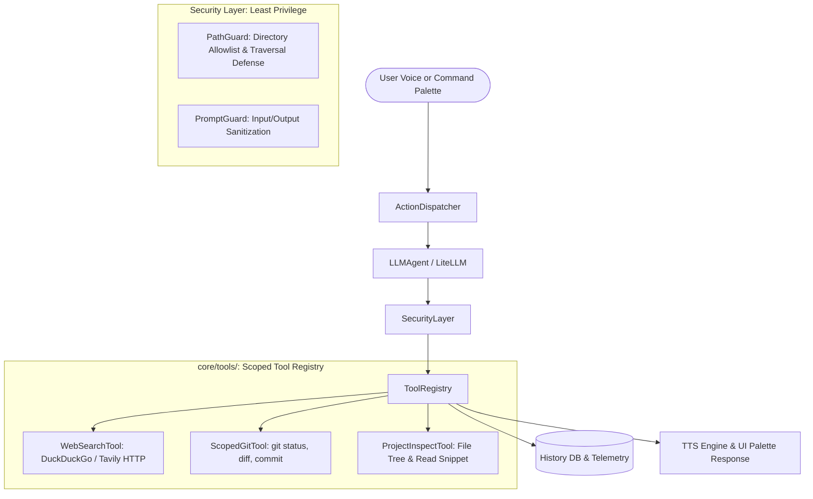

# Scoped Developer & Web Search Tools Design Spec

**Date:** 2026-09-06  
**Status:** Approved  
**Target:** `python-jarvis`  

---

## 1. Overview & Goals

Currently, Jarvis operates primarily as a macro-based execution engine and media controller. When the user asks technical questions or issues complex dev commands, Jarvis can only reply conversationally or trigger pre-mapped UI/terminal actions.

This design introduces a **Scoped Tool System** focused on two key capabilities:
1. **Web Search & Technical Information Retrieval (Capability A):** Fast, lightweight, headless web searches (via DuckDuckGo/Tavily HTTP endpoints) to fetch real-time documentation, answers, and summaries without launching heavy browser processes or consuming background CPU.
2. **Scoped Developer Tools (Capability C):** Controlled Git inspection (`git status`, `git diff`), intelligent commit message generation, and project directory exploration strictly constrained by directory allowlists and the Principle of Least Privilege.

### Key Objectives:
- **Least Privilege Architecture:** Jarvis has **zero** elevated or arbitrary OS access. All tools operate through strict parameter validation, path containment checks, and explicit risk tiers.
- **Ultra-low Resource Footprint:** Zero persistent background daemons, zero headless browser instances, zero heavy local neural models. All retrieval is done via ephemeral, lightweight HTTPS requests or constrained local subprocess calls.
- **Seamless User Experience:** Safe read-only actions execute instantly and synthesize concise voice (TTS) and UI feedback. Destructive or mutating operations (e.g. `git commit`) require explicit user authorization via the existing PySide6 `SecurityDialog`.

---

## 2. Architecture & Component Boundaries



### 2.1 Module Breakdown

#### A. `core/security/path_guard.py`
A path validation utility enforcing strict directory isolation:
- Resolves all paths using `pathlib.Path(path).resolve()` to neutralize symlinks and `../` directory traversal attempts.
- Checks candidate paths against configured `allowed_workspaces`.
- Rejects any system directory (`C:\Windows`, `C:\Program Files`, AppData, user roots) unless explicitly whitelisted.
- Raises `SecurityError` and categorizes out-of-bound requests as `RiskLevel.BLOCKED`.

#### B. `core/tools/base.py`
Defines the base interface for all tools:
```python
from abc import ABC, abstractmethod
from typing import Any
from core.execution.execution_plan import RiskLevel

class BaseTool(ABC):
    name: str
    description: str
    risk_level: RiskLevel

    @abstractmethod
    def execute(self, **kwargs: Any) -> dict[str, Any]:
        """Executes the tool with validated parameters and returns a structured result."""
        pass
```

#### C. `core/tools/web_search_tool.py`
Lightweight HTTP search retriever:
- Uses `urllib` / standard HTTP requests to query DuckDuckGo Instant Answer / HTML Lite API or Tavily (if `TAVILY_API_KEY` is present).
- Strips HTML tags, trims summaries to a strict character budget (max 1000 tokens) to minimize memory and LLM context overhead.
- Hard timeout of 5.0 seconds with graceful fallback on network failure.
- `risk_level`: `RiskLevel.SAFE` (read-only query).

#### D. `core/tools/git_tool.py`
Encapsulated Git operations strictly bound to validated workspaces:
- **`git_status(workspace: str)`**: Runs `git status --short --branch`, returns modified files and current branch.
- **`git_diff_summary(workspace: str, max_lines: int = 300)`**: Captures staged and unstaged diffs, truncating at `max_lines` to protect memory and context windows.
- **`git_commit(workspace: str, message: str)`**: Commits staged changes with the specified message. Requires confirmation (`risk_level: RiskLevel.MEDIUM`).
- **Security Constraints:** All calls execute via `subprocess.run(args, shell=False, cwd=workspace, check=True)` where `workspace` has passed `PathGuard` validation.

#### E. `core/tools/project_tool.py`
Safe project structure exploration:
- **`list_files(workspace: str, max_depth: int = 2)`**: Returns a sanitized tree representation of directories and files, automatically ignoring `.git`, `node_modules`, `__pycache__`, `.venv`.
- **`read_file_snippet(file_path: str, max_bytes: int = 50_000)`**: Reads up to 50KB of a specific source file within an allowed workspace. Prevents reading large binaries or multi-megabyte dumps.

#### F. `core/tools/tool_registry.py`
Central catalog:
- Registers all enabled tools during bootstrap.
- Supplies tool definitions/schemas to `LLMAgent`.
- Dispatches execution to the target tool after security authorization.

---

## 3. LLM Integration & Execution Loop

### 3.1 Decision Schema
`LLMAgent` prompt is enhanced with tool capabilities. When an instruction requires dynamic information retrieval or dev assistance, the LLM produces a `tool_call` response:

```json
{
    "type": "tool_call",
    "tool_name": "git_diff_summary",
    "parameters": {
        "workspace": "C:\\Programacao\\python-jarvis"
    },
    "explanation": "Consultando alterações no repositório para gerar o commit.",
    "risk_level": "safe"
}
```

### 3.2 Two-Stage Reasoning & Synthesis
1. **Trigger:** User speaks or types *"Jarvis, gere um commit para o que eu alterei no repositório Jarvis"*.
2. **Tool Dispatch:** `LLMAgent` generates a `tool_call` targeting `git_diff_summary`.
3. **Execution & Context Return:** The tool executes in under 50ms, returning the diff.
4. **Synthesis:** `LLMAgent` receives the diff output and synthesizes the final commit message following Conventional Commits (e.g. `feat(tools): add scoped git and web search tools`).
5. **Action Proposal:** If the user asked to commit, Jarvis prepares a `git_commit` plan and presents the `SecurityDialog` modal before running.

---

## 4. Configuration Schema (`config.yaml`)

New entries in `config.yaml` to govern tool availability and boundary enforcement:

```yaml
# ==============================================================================
# FERRAMENTAS E INTEGRAÇÕES SEGURAS (LEAST PRIVILEGE)
# ==============================================================================
tools:
  web_search:
    enabled: true
    provider: "duckduckgo"          # duckduckgo ou tavily
    max_results: 3
    timeout_seconds: 5.0

  developer:
    enabled: true
    # Apenas os diretórios abaixo podem ser inspecionados ou manipulados:
    allowed_workspaces:
      - "C:\\Programacao\\python-jarvis"
    git:
      allow_commit: true            # Permite commitar após autorização na tela
      max_diff_lines: 300           # Proteção contra diffs massivos
    project:
      max_file_size_kb: 50          # Limite de leitura por arquivo
```

---

## 5. Security & Least Privilege Analysis

| Threat / Risk Vector | Mitigation Strategy |
| :--- | :--- |
| **Directory Traversal (`../../Windows`)** | `PathGuard` resolves all relative paths with `resolve()` and validates they are subpaths of `allowed_workspaces`. |
| **Command Injection in Git args** | `shell=False` used exclusively. All arguments are passed as fixed lists of strings (e.g. `["git", "commit", "-m", msg]`). No shell evaluation. |
| **Excessive Memory Allocation** | Diffs are capped at 300 lines; file reads are capped at 50KB; search queries return max 3 trimmed snippets. |
| **Network Abuse / Data Exfiltration** | Web searches are strictly text queries via public search APIs; no outbound socket listeners; no file uploads. |
| **Accidental Code Destruction** | Destructive Git commands (`reset --hard`, `clean -fd`, `push --force`, `branch -D`) are explicitly **NOT implemented** and classified as `RiskLevel.BLOCKED`. |

---

## 6. Testing Strategy

1. **`tests/test_path_guard.py`:**
   - Validates authorized workspaces.
   - Tests traversal rejection (`../`, `..\..\Windows`).
   - Tests symlinks pointing outside the workspace.
   - Tests unconfigured/empty workspace lists.
2. **`tests/test_web_search_tool.py`:**
   - Tests successful query parsing with mocked HTTP client.
   - Tests network timeout handling and graceful fallback messages.
   - Tests empty search results.
3. **`tests/test_git_tool.py`:**
   - Tests `git status` with mock subprocess.
   - Tests `git diff` line truncation.
   - Tests unauthorized workspace rejection.
4. **`tests/test_tool_registry.py`:**
   - Tests tool dispatching, risk level inheritance, and disabled tool handling.
5. **Integration Tests (`tests/test_llm_tools_flow.py`):**
   - End-to-end simulation from user prompt to tool execution to synthesized response.
