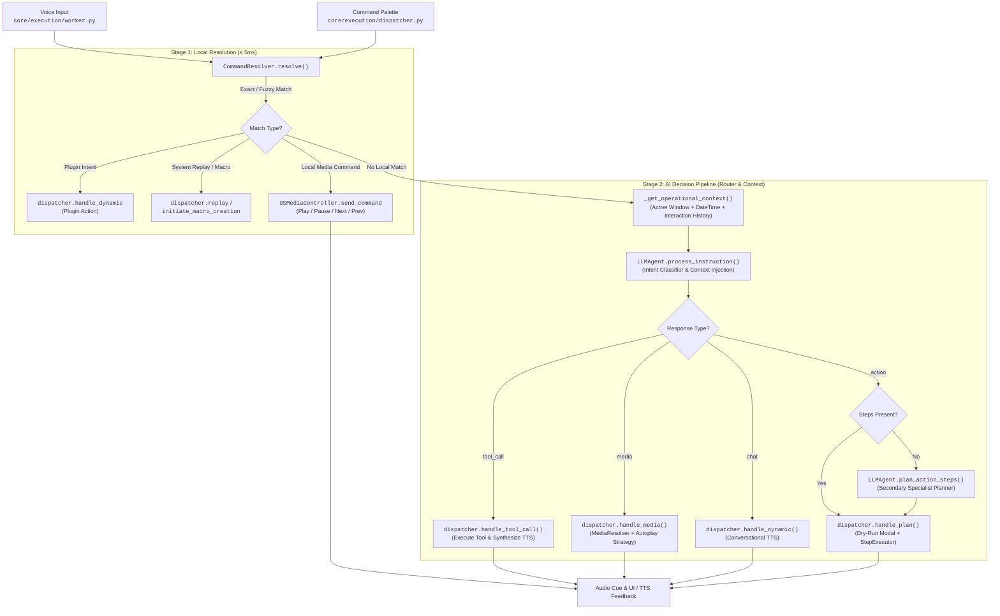

# Architecture Specification: AI Pipeline, Operational Context, and Multi-Stage Command Routing

**Date:** 2026-09-07  
**Status:** Implemented & Verified  
**Target:** `python-jarvis`  

---

## 1. Executive Summary & Problem Statement

The Jarvis AI Assistant operates under a **local-first** architecture designed for Windows task automation via voice and text. Following the introduction of dynamic tool catalogs, this specification consolidates the architectural modernization of Jarvis's execution, context, and intelligence pipelines.

Historically, the system faced four significant architectural challenges:

1. **Execution Path Disparity (Voice vs. Text):** Media commands executed via voice (`core/execution/worker.py`) leveraged specialized resolution logic (`MediaResolver`, Spotify autoplay, and fallback strategies). However, text inputs dispatched via the Command Palette (`core/execution/dispatcher.py`) bypassed this logic and attempted to parse media payloads as raw execution plans, failing because media dictionaries lack an explicit `steps` array.
2. **Operational Context Blindness:** The LLM reasoning engine operated in a stateless vacuum without awareness of the desktop environment: it lacked knowledge of the active window/process, current date and time, and recent conversational history. This prevented natural multi-turn interactions (e.g., *"close this window"*, *"repeat that calculation"*, or *"what day is it?"*).
3. **Unnecessary Cloud Latency on Media Controls:** Basic media controls (*"pause"*, *"resume"*, *"next track"*, *"previous track"*) were not handled by local matchers, forcing roundtrips through cloud LLMs (~1.5s latency and token consumption) simply to emit a playback command that the operating system can execute in < 5ms.
4. **Monolithic Planner Bottleneck:** Requiring an LLM to simultaneously classify user intent, assess security risk, and generate fine-grained Windows automation steps in a single JSON payload overloaded smaller, cost-effective models (e.g., Gemini Flash, Claude Haiku, DeepSeek), leading to JSON syntax errors and plan generation failures.

This specification unifies the design across four foundational pillars:
- **Pillar 1 — Universal Media Parity in `ActionDispatcher`:** Unifying voice and text media handling within a centralized dispatcher method.
- **Pillar 2 — Connected Operational Context:** Injecting real-time desktop telemetry, temporal data, and recent command history into the LLM prompt.
- **Pillar 3 — Real Local-First Media Routing:** Intercepting universal media control phrases inside the local `CommandResolver` for instantaneous (< 5ms) OS-level execution.
- **Pillar 4 — Router-Planner Decomposition:** Separating high-level intent classification from atomic OS automation planning and tool response synthesis.

---

## 2. End-to-End Architecture & Data Flow



---

## 3. Detailed Component Specifications

---

### 3.1 Pillar 1: Universal Media Parity in `ActionDispatcher`

#### 3.1.1 Problem & Root Cause
In `core/execution/worker.py`, voice-activated instructions had dedicated inline handling to resolve media requests via `MediaResolver` and append `SPOTIFY_CLICK_PLAY` execution steps based on `AutoplayStrategy`. 

Conversely, `ActionDispatcher.dispatch()` in `core/execution/dispatcher.py` handled `type: "media"` by attempting to construct an `ExecutionPlan.from_dict(llm_res)`. Because the media response schema produced by `LLMAgent` contains `{type: "media", action: "PLAY_QUERY", query: "...", query_type: "..."}` rather than a `steps` list, deserialization failed, rendering music search and playback non-functional via the Command Palette.

#### 3.1.2 Architectural Solution
Centralize media plan construction and dispatching directly within `ActionDispatcher.handle_media()`, ensuring both voice and text inputs share an identical execution path.

**Implementation in `core/execution/dispatcher.py`:**
```python
def handle_media(self, action_json: dict[str, Any]) -> bool:
    """Resolves and dispatches media automation plans (Spotify and OS Media)."""
    from core.media.models import (
        AutoplayStrategy,
        MediaAction,
        MediaIntent,
        QueryType,
    )
    from core.media.resolver import MediaResolver

    try:
        m_action = MediaAction(action_json.get("action"))
    except ValueError:
        m_action = MediaAction.PLAY_QUERY

    q_type_str = action_json.get("query_type")
    q_type = None
    if q_type_str:
        try:
            q_type = QueryType(q_type_str)
        except ValueError:
            q_type = QueryType.MIXED

    m_intent = MediaIntent(
        action=m_action, query=action_json.get("query"), query_type=q_type
    )

    resolver_obj = MediaResolver()
    resolved_plan = resolver_obj.resolve_intent(m_intent)
    if not resolved_plan:
        logger.warning("Failed to resolve media plan.")
        self.tts_engine.speak("Desculpe, não consegui preparar a mídia.")
        return True

    plan = ExecutionPlan(
        intent=action_json.get("action", "media"),
        explanation=action_json.get("description", "Ação de mídia"),
        steps=resolved_plan.steps,
        global_risk=RiskLevel.SAFE,
    )

    uri = (
        resolved_plan.steps[0].payload.get("target")
        if resolved_plan.steps
        else None
    )
    if resolved_plan.strategy == AutoplayStrategy.TAB_ENTER:
        plan.steps.append(
            ExecutionStep(
                type=StepType.SPOTIFY_CLICK_PLAY,
                payload={"click_type": "search", "uri": uri},
                description="Spotify Click & Play Autoplay (Search)",
            )
        )
    elif resolved_plan.strategy == AutoplayStrategy.MEDIA_KEY:
        plan.steps.append(
            ExecutionStep(
                type=StepType.SPOTIFY_CLICK_PLAY,
                payload={"click_type": "playlist", "uri": uri},
                description="Spotify Click & Play Autoplay (Playlist)",
            )
        )

    self.handle_plan(plan)
    return True
```

**Integration Points:**
- **Text Palette (`core/execution/dispatcher.py`):**
  ```python
  elif res_type == "media":
      return self.handle_media(llm_res)
  ```
- **Voice Worker (`core/execution/worker.py`):**
  ```python
  elif action_json.get("type") == "media":
      from core.execution.dispatcher import ActionDispatcher
      return ActionDispatcher.handle_media(dispatcher, action_json)
  ```

---

### 3.2 Pillar 2: Connected Operational Context (Grounding & Multi-Turn)

#### 3.2.1 Problem & Root Cause
The assistant previously operated without environmental grounding:
- **No Temporal Awareness:** Incapable of answering queries regarding the current date, time, or day of the week.
- **No Window/Process Awareness:** Unable to resolve relative commands such as *"close this window"*, *"refresh the browser"*, or *"what program is this?"*.
- **No Interaction History:** Unable to maintain continuity across conversational turns (e.g., *"repeat the last search for Python 3.13"* or *"explain that again"*).

#### 3.2.2 Architectural Solution
1. **Multi-Turn Interaction Retrieval in `core/persistence/history_db.py`:**
   Add `get_recent_interactions(self, limit: int = 3) -> list[dict[str, str]]` to fetch recent successful user queries and their resolved intents in chronological order:
   ```python
   def get_recent_interactions(self, limit: int = 3) -> list[dict[str, str]]:
       """Fetches the last N successful interactions for multi-turn LLM context."""
       try:
           with self.connection() as conn:
               cursor = conn.cursor()
               cursor.execute(
                   """
                   SELECT input_text, intent
                   FROM command_history
                   WHERE execution_status = 'success'
                   AND input_text IS NOT NULL
                   ORDER BY timestamp DESC
                   LIMIT ?
                   """,
                   (limit,),
               )
               rows = cursor.fetchall()
               return [
                   {"query": str(r[0]), "intent": str(r[1])}
                   for r in reversed(rows)
               ]
       except Exception as e:
           logger.error(f"Error retrieving recent interactions: {e}")
           return []
   ```

2. **Telemetry Gathering in `core/ai/llm_agent.py`:**
   Gather dynamic operational context before each LLM invocation:
   ```python
   def _get_operational_context(self) -> dict[str, str]:
       """Gathers dynamic operational context: date/time, active window, and recent history."""
       from datetime import datetime

       weekdays = [
           "Segunda-feira",
           "Terça-feira",
           "Quarta-feira",
           "Quinta-feira",
           "Sexta-feira",
           "Sábado",
           "Domingo",
       ]
       now = datetime.now()
       dt_str = f"{weekdays[now.weekday()]}, {now.strftime('%d/%m/%Y %H:%M')}"

       win_ctx = "Área de Trabalho / Nenhuma janela ativa"
       try:
           from core.execution.window_manager import WindowManager

           win = WindowManager.get_active_window()
           if win and win.title:
               proc = f" (Processo: {win.process_name})" if win.process_name else ""
               win_ctx = f'"{win.title}"{proc}'
       except Exception as e:
           logger.debug(f"Could not retrieve active window context: {e}")

       recent = history_manager.get_recent_interactions(limit=2)
       if recent:
           recent_str = "; ".join(f'"{r["query"]}" -> {r["intent"]}' for r in recent)
       else:
           recent_str = "Nenhuma interação recente."

       return {
           "datetime": dt_str,
           "active_window": win_ctx,
           "recent_interactions": recent_str,
       }
   ```

3. **Prompt Injection Contract:**
   The assembled operational context block is injected directly into the system prompt:
   ```text
   Contexto Operacional do Sistema:
   - Data e Hora Atual: {op_ctx['datetime']}
   - Janela em Foco no Windows: {op_ctx['active_window']}
   - Histórico Recente do Usuário: [{op_ctx['recent_interactions']}]
   ```

---

### 3.3 Pillar 3: Real Local-First Media Routing (Instant Fast-Path)

#### 3.3.1 Problem & Root Cause
Universal audio controls (*"pausar"*, *"continuar"*, *"próxima música"*, *"faixa anterior"*) were previously unmapped in `CommandResolver`. Consequently, every playback request defaulted to cloud LLMs, incurring ~1.5s latency and cloud API costs for actions that should be instantaneous.

#### 3.3.2 Architectural Solution
1. **System Aliases in `core/ai/command_resolver.py`:**
   Register standard media control phrases as local system intents:
   ```python
   SYSTEM_ALIASES = {
       "replay": [
           "repetir", "repete", "repetir ultimo comando", "faz de novo", "de novo",
       ],
       "create_macro": [
           "salvar como macro", "criar macro", "salve isso", "gravar sequencia",
       ],
       "media_pause": [
           "pausar", "pausa", "pausar musica", "parar musica", "pausar a musica",
       ],
       "media_play": [
           "continuar", "play", "despausar", "continuar musica", "tocar musica",
       ],
       "media_next": [
           "proxima musica", "proxima faixa", "avancar musica", "pular musica", "proxima",
       ],
       "media_prev": [
           "musica anterior", "voltar musica", "faixa anterior", "anterior",
       ],
   }
   ```

2. **Instant Local Dispatcher in `core/execution/dispatcher.py`:**
   Execute native Windows virtual key events directly via `OSMediaController`:
   ```python
   def handle_local_media_command(self, intent_name: str) -> bool:
       """Executes instantaneous OS-level media control commands without LLM."""
       from core.media.models import MediaAction
       from core.media.providers.os_controller import OSMediaController

       action_map = {
           "media_pause": (MediaAction.PAUSE, "Mídia pausada."),
           "media_play": (MediaAction.PLAY, "Reproduzindo."),
           "media_next": (MediaAction.NEXT, "Próxima faixa."),
           "media_prev": (MediaAction.PREV, "Faixa anterior."),
       }
       entry = action_map.get(intent_name)
       if entry:
           action, msg = entry
           success = OSMediaController.send_command(action)
           self.tts_engine.speak(msg)
           return success
       return False
   ```
   - **Voice Route (`core/execution/worker.py`):**
     ```python
     if result.is_system and result.intent_name.startswith("media_"):
         return ActionDispatcher.handle_local_media_command(dispatcher, result.intent_name)
     ```
   - **Text Route (`core/execution/dispatcher.py`):**
     ```python
     if result.is_system and result.intent_name.startswith("media_"):
         return self.handle_local_media_command(result.intent_name)
     ```

**Performance Benefit:** Command latency drops from ~1500ms (cloud LLM) to < 5ms (local Windows virtual keystroke).

---

### 3.4 Pillar 4: Router-Planner Decomposition (Two-Stage Architecture)

#### 3.4.1 Problem & Root Cause
Forcing a single LLM call to classify intent and simultaneously generate detailed execution step schemas (commands, paths, targets, durations, risks) resulted in high prompt token overhead and frequent JSON validation errors when using compact models.

#### 3.4.2 Architectural Solution
Deconstruct the AI reasoning pipeline into specialized, cohesive stages:

1. **Stage 1 — Intent Router (`LLMAgent.process_instruction`):**
   Analyzes the user instruction alongside the operational context and returns one of four strict JSON structures:
   - `chat`: Conversational response or query answer.
   - `tool_call`: Parameterized call to an internal tool (weather, finance, calculator, git, web search).
   - `media`: High-level music/media search and playback intent.
   - `action`: Automation plan containing an intent, explanation, global risk level, and optional execution steps.

2. **Stage 2 — Specialist Action Planner (`LLMAgent.plan_action_steps`):**
   If an `action` intent is returned without explicit execution steps, the specialist planner is triggered to formulate atomic physical steps:
   ```python
   if json_data.get("type") == "action" and not json_data.get("steps"):
       logger.info("Action intent returned without steps. Invoking specialist planner...")
       json_data["steps"] = self.plan_action_steps(
           text=text,
           intent=json_data.get("intent", "custom_action"),
           explanation=json_data.get("explanation", "Executando ação"),
           global_risk=json_data.get("global_risk", "low"),
       )
   ```

3. **Stage 3 — Tool Response Synthesis (`LLMAgent.synthesize_tool_response`):**
   When a `tool_call` finishes execution, the raw structured output is synthesized into natural, spoken TTS feedback (or follow-up action steps, such as `git_commit` following a `git_diff`).

---

## 4. Structured Output Contracts

### 4.1 Chat Schema
```json
{
  "type": "chat",
  "message": "Conversational response synthesized for text-to-speech output."
}
```

### 4.2 Media Schema
```json
{
  "type": "media",
  "action": "PLAY_QUERY",
  "query": "lofi hip hop",
  "query_type": "mood",
  "description": "Tocando lofi"
}
```
*Valid `action` values:* `PLAY_QUERY`, `PLAY`, `PAUSE`, `NEXT`, `PREV`.  
*Valid `query_type` values:* `entity` (specific artist/album), `mood` (genre/mood), `mixed` (hybrid).

### 4.3 Tool Call Schema
```json
{
  "type": "tool_call",
  "tool_name": "web_search",
  "parameters": {
    "query": "latest Python release"
  },
  "explanation": "Pesquisando versão do Python na web",
  "risk_level": "safe"
}
```

### 4.4 Action Plan Schema
```json
{
  "schema_version": "1.0",
  "type": "action",
  "intent": "open_ide",
  "explanation": "Abrindo o projeto no VS Code",
  "global_risk": "low",
  "steps": [
    {
      "type": "command",
      "command": "code .",
      "target": "",
      "text": "",
      "duration": 1.0,
      "step_risk": "low",
      "description": "Executar VS Code no terminal"
    }
  ]
}
```
*Valid `type` values for steps:* `command`, `open_app`, `write`, `navigate`, `wait`, `tool`, `spotify_click_play`.  
*Risk levels:* `safe`, `low`, `medium`, `high`, `dangerous`, `blocked`.

---

## 5. Verification Matrix & Testing Strategy

| Architectural Component | Automated Test Suite | Manual Verification Protocol |
| :--- | :--- | :--- |
| **Universal Media Parity** | `tests/integration/test_llm_tools_flow.py::test_dispatcher_dispatch_media` | Enter *"tocar lofi"* into the Command Palette and verify that Spotify launches with autoplay enabled. |
| **Operational Context** | `tests/unit/test_llm_agent.py::test_llm_agent_operational_context` | Focus VS Code and ask *"qual janela está aberta?"* or ask *"que horas são?"* and verify accurate response. |
| **Local-First Media Control** | `tests/unit/test_command_resolver.py::test_resolver_media_commands`<br/>`tests/integration/test_llm_tools_flow.py::test_dispatcher_dispatch_local_media`<br/>`tests/integration/test_llm_tools_flow.py::test_worker_local_media` | Speak *"pausar música"* or *"próxima faixa"* and verify instant OS playback adjustment without LLM network traffic. |
| **Router-Planner Decomposition** | `tests/unit/test_llm_agent.py::test_llm_agent_plan_action_steps`<br/>`tests/unit/test_llm_agent.py::test_llm_agent_two_stage_action_fallback` | Issue a complex multi-step request and verify that the two-stage pipeline synthesizes sequential execution steps cleanly. |
| **Multi-Turn Interaction History** | `tests/unit/test_llm_agent.py` and history manager test fixtures | Issue two sequential commands and verify that the second command's prompt includes the prior interaction. |

---

## 6. Security, Sandboxing, and Non-Regression Guarantees

1. **Input and Output Sanitization (`PromptGuard`):**
   - User inputs are analyzed before tokenization to intercept prompt injection attempts. Suspicious queries are rejected with an immediate chat refusal message.
   - LLM-generated output plans are sanitized prior to execution to prevent execution outside safe operational limits.
2. **Fail-Closed Risk Assessment:**
   - If an LLM response provides an invalid or unrecognized `global_risk` level, the system defaults to `"high"` risk.
   - Actions classified as `medium`, `high`, or `dangerous` trigger user confirmation modals (`SecurityDialog`) in interactive sessions.
3. **Execution Safety:**
   - Any action containing destructive tokens (`format`, `rmdir /s /q C:`) is classified as `blocked` and barred from execution by `StepExecutor`.
   - All state-modifying actions are logged to SQLite via `history_manager` for auditability and replay tracking.
