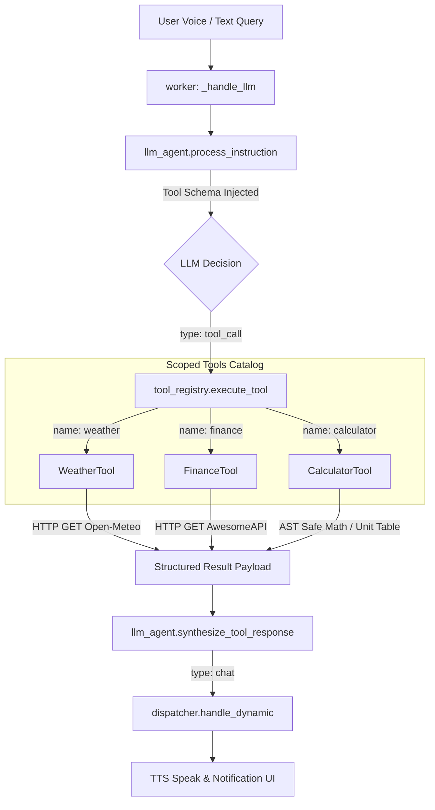

# Quick Information Tools Design Spec (Weather, Finance, Calculator)

**Date:** 2026-09-07  
**Status:** Approved  
**Target:** `python-jarvis`  

---

## 1. Overview & Goals

The Jarvis AI Assistant currently possesses scoped developer tools (`git`, `project_inspect`) and general technical web retrieval (`web_search`). However, everyday operational queries such as weather forecasts, currency quotes, and fast mathematical/unit calculations either trigger unconstrained web searches or conversational approximations from the LLM.

This design introduces a suite of **Quick Information Tools** integrated natively into Jarvis's two-stage tool-calling architecture:
1. **Weather Tool (`WeatherTool`):** Fetches real-time weather and forecast data via Open-Meteo's free, keyless Geocoding & Forecast HTTP APIs, with configurable default location support.
2. **Finance Tool (`FinanceTool`):** Fetches live currency quotes and performs automated currency conversions using AwesomeAPI's keyless, real-time endpoints.
3. **Calculator & Unit Converter Tool (`CalculatorTool`):** Performs deterministic, safe arithmetic evaluation via Python's Abstract Syntax Tree (`ast.parse`) without unsafe `eval()`, alongside common physical and digital unit conversions.

### Key Objectives:
- **Zero Cost & Zero Setup:** No paid APIs, no API key onboarding required; utilizes Open-Meteo and AwesomeAPI public endpoints.
- **Ultra-Low Resource Footprint:** Standard library `urllib.request` for HTTP calls (5s timeout); 100% offline, zero-network evaluation for mathematics and unit conversions.
- **Strict Safety (`RiskLevel.SAFE`):** Read-only data queries and deterministic in-memory calculations without filesystem side-effects or OS interactions.
- **Robust Integration:** Seamless schema injection into `LLMAgent` and natural language vocal synthesis via `worker.py`.

---

## 2. Architecture & Execution Flow

The feature integrates into the established `core/tools` subsystem inheriting from `BaseTool`:



---

## 3. Tool Specifications & Data Contracts

### 3.1 Weather Tool (`WeatherTool`)
- **Module:** `core/tools/weather_tool.py`
- **Class:** `WeatherTool(BaseTool)`
- **Tool Name:** `"weather"`
- **Risk Level:** `RiskLevel.SAFE`
- **Configuration Keys:** `tools.weather.enabled`, `tools.weather.default_city`, `tools.weather.timeout_seconds`
- **Parameters Schema:**
  ```json
  {
    "type": "object",
    "properties": {
      "city": {
        "type": "string",
        "description": "City name for weather query (e.g., 'São Paulo', 'London'). Optional; uses default if omitted."
      }
    }
  }
  ```
- **Execution Mechanism:**
  1. **City Resolution:** If `city` is null/empty, reads `default_city` from `config.yaml` (fallback: `"São Paulo"`).
  2. **Geocoding Step:**
     - `GET https://geocoding-api.open-meteo.com/v1/search?name={encoded_city}&count=1&language=pt&format=json`
     - Extracts `latitude`, `longitude`, `name`, `admin1`, `country`.
     - Returns graceful error if city is not found.
  3. **Forecast Step:**
     - `GET https://api.open-meteo.com/v1/forecast?latitude={lat}&longitude={lon}&current=temperature_2m,relative_humidity_2m,apparent_temperature,precipitation,weather_code,wind_speed_10m&timezone=auto`
  4. **WMO Code Mapping:** Translates standard WMO codes (0 to 99) into user-friendly Brazilian Portuguese descriptions (`"Céu limpo"`, `"Parcialmente nublado"`, `"Chuva fraca"`, `"Tempestade"`, etc.).
- **Response Format:**
  ```json
  {
    "success": true,
    "city": "São Paulo, São Paulo, Brasil",
    "temperature": 24.5,
    "apparent_temperature": 25.1,
    "humidity": 65,
    "condition": "Parcialmente nublado",
    "wind_speed_kmh": 12.0,
    "precipitation_mm": 0.0
  }
  ```

---

### 3.2 Finance Tool (`FinanceTool`)
- **Module:** `core/tools/finance_tool.py`
- **Class:** `FinanceTool(BaseTool)`
- **Tool Name:** `"finance"`
- **Risk Level:** `RiskLevel.SAFE`
- **Configuration Keys:** `tools.finance.enabled`, `tools.finance.timeout_seconds`
- **Parameters Schema:**
  ```json
  {
    "type": "object",
    "properties": {
      "currencies": {
        "type": "string",
        "description": "Currency pair (e.g. 'USD-BRL', 'EUR-BRL', 'BTC-BRL') or friendly alias ('dolar', 'euro', 'bitcoin')."
      },
      "amount": {
        "type": "number",
        "description": "Optional numeric amount to convert from base to target currency."
      }
    },
    "required": ["currencies"]
  }
  ```
- **Execution Mechanism:**
  1. **Alias Normalization:** Translates informal terms (`"dolar"` -> `"USD-BRL"`, `"euro"` -> `"EUR-BRL"`, `"bitcoin"` -> `"BTC-BRL"`).
  2. **API Request:**
     - `GET https://economia.awesomeapi.com.br/last/{pair}`
     - Extracts `bid`, `high`, `low`, `pctChange`, `name`.
  3. **Conversion Calculation:** If `amount` is provided, computes `converted_value = round(amount * float(bid), 2)`.
- **Response Format:**
  ```json
  {
    "success": true,
    "pair": "USD-BRL",
    "name": "Dólar Americano/Real Brasileiro",
    "bid": 5.72,
    "high": 5.75,
    "low": 5.69,
    "pct_change": "+0.45%",
    "original_amount": 50.0,
    "converted_value": 286.0
  }
  ```

---

### 3.3 Calculator & Unit Converter Tool (`CalculatorTool`)
- **Module:** `core/tools/calculator_tool.py`
- **Class:** `CalculatorTool(BaseTool)`
- **Tool Name:** `"calculator"`
- **Risk Level:** `RiskLevel.SAFE`
- **Configuration Keys:** `tools.calculator.enabled`
- **Parameters Schema:**
  ```json
  {
    "type": "object",
    "properties": {
      "expression": {
        "type": "string",
        "description": "Mathematical expression to evaluate (e.g., '(150 + 80) * 1.15', '2 ** 10')."
      },
      "convert_value": {
        "type": "number",
        "description": "Numeric value to convert between units."
      },
      "from_unit": {
        "type": "string",
        "description": "Source unit (e.g., 'km', 'mi', 'c', 'f', 'kg', 'lb', 'gb', 'mb')."
      },
      "to_unit": {
        "type": "string",
        "description": "Target unit (e.g., 'km', 'mi', 'c', 'f', 'kg', 'lb', 'gb', 'mb')."
      }
    }
  }
  ```
- **Execution Mechanism:**
  1. **Safe AST Evaluation:**
     - Parses `expression` using `ast.parse(expr, mode="eval")`.
     - Validates node whitelist: `ast.Expression`, `ast.BinOp`, `ast.UnaryOp`, `ast.Constant`, `ast.Num`, `ast.Add`, `ast.Sub`, `ast.Mult`, `ast.Div`, `ast.FloorDiv`, `ast.Mod`, `ast.Pow`, `ast.USub`, `ast.UAdd`.
     - Explicitly blocks any `ast.Call`, `ast.Attribute`, `ast.Name`, `ast.Import`, `ast.Lambda`, preventing arbitrary code execution.
     - Guards against `ZeroDivisionError` and excessive exponent values (`pow > 1000` to prevent CPU exhaustion).
  2. **Deterministic Unit Conversions:**
     - Supported domains:
       - Length/Distance: `km`, `m`, `cm`, `mi`, `ft`, `in`.
       - Mass/Weight: `kg`, `g`, `lb`, `oz`.
       - Temperature: `c` (Celsius), `f` (Fahrenheit), `k` (Kelvin).
       - Digital Storage: `b`, `kb`, `mb`, `gb`, `tb`.
- **Response Format (Calculation):**
  ```json
  {
    "success": true,
    "operation": "calculate",
    "expression": "(150 + 80) * 1.15",
    "result": 264.5
  }
  ```
- **Response Format (Conversion):**
  ```json
  {
    "success": true,
    "operation": "convert",
    "from_value": 100.0,
    "from_unit": "km",
    "to_unit": "mi",
    "result": 62.1371
  }
  ```

---

## 4. Configuration Updates (`config.yaml`)

```yaml
tools:
  web_search:
    enabled: true
    provider: "duckduckgo"
    max_results: 3
    timeout_seconds: 5.0

  developer:
    enabled: true
    allowed_workspaces:
      - "."
      - "C:\\Programacao\\python-jarvis"
    git:
      allow_commit: true
      max_diff_lines: 300
    project:
      max_file_size_kb: 50

  weather:
    enabled: true
    default_city: "São Paulo"
    timeout_seconds: 5.0

  finance:
    enabled: true
    timeout_seconds: 5.0

  calculator:
    enabled: true
```

---

## 5. Security & Risk Analysis

| Threat / Risk Vector | Mitigation Strategy |
| :--- | :--- |
| **Arbitrary Code Execution via Math Expression** | Evaluated strictly via an Abstract Syntax Tree (`ast.parse`) node whitelist. All function calls (`eval`, `exec`, `__import__`, `os.system`) and variable references are rejected before evaluation. |
| **CPU Denial of Service via Huge Powers** | Powers (`**`) are checked to reject exponents greater than `1000` and bases greater than `1000000`. |
| **Network Hangs / Offline Stalls** | All external HTTP calls use a strict 5.0s socket timeout via `urllib.request`. Exceptions are caught gracefully without blocking worker threads. |
| **Private Data Exfiltration** | No user code, filesystem paths, or local secrets are ever transmitted in weather or finance queries. Only the requested city name or currency pair is sent. |

---

## 6. Testing Strategy

1. **`tests/unit/test_weather_tool.py`:**
   - Geocoding and forecast resolution with mocked HTTP responses.
   - Default city fallback when no city is passed.
   - Handling of unknown cities and HTTP timeouts.
2. **`tests/unit/test_finance_tool.py`:**
   - Currency lookup and alias normalization (e.g. `"dolar"` -> `"USD-BRL"`).
   - Amount conversion computation (`amount * bid`).
   - Handling of network failure and invalid pairs.
3. **`tests/unit/test_calculator_tool.py`:**
   - Arithmetic evaluation for addition, multiplication, powers, modulus.
   - Division by zero prevention.
   - Rejection of malicious code strings (`"__import__('os').system('dir')"`).
   - Physical unit conversions (Celsius <-> Fahrenheit, km <-> mi, kg <-> lb).
4. **`tests/integration/test_llm_tools_flow.py`:**
   - End-to-end integration test validating a `tool_call` for `weather`, tool execution, and vocal synthesis.
